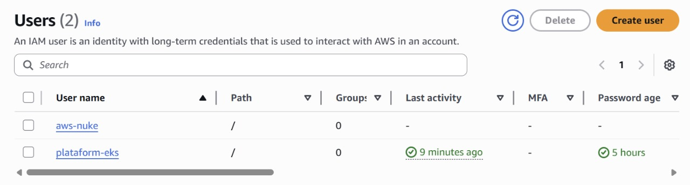
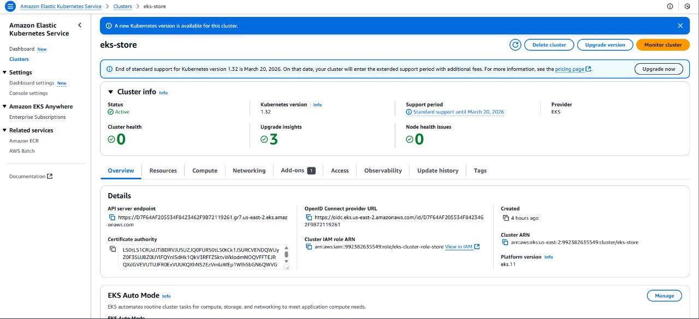
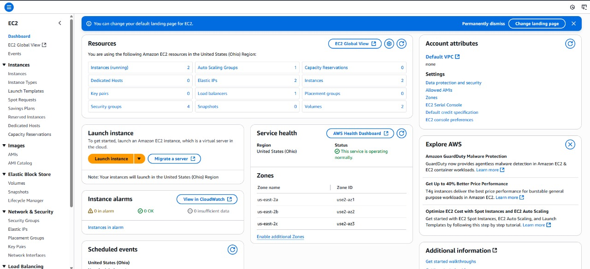
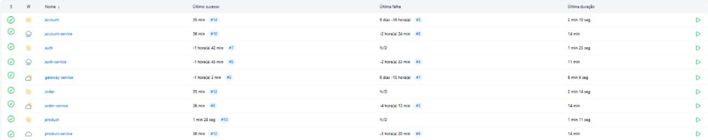

# Projeto em Grupo — Plataformas, Microsserviços e APIs

## Configuração na AWS

A **Amazon Web Services (AWS)** fornece um portfólio extenso de serviços em nuvem — computação, armazenamento, bancos de dados, redes, análises, mobilidade, ferramentas de desenvolvimento, governança e segurança, entre outros.

Para dar início ao ambiente, criamos um usuário com a política **AdministratorAccess** chamado **`platform`**.



---

## Provisionamento do Amazon EKS

O **Amazon Elastic Kubernetes Service (EKS)** é um serviço gerenciado que libera o time de manter o plano de controle e os nós mestres do Kubernetes. Dessa forma, podemos concentrar o esforço no ciclo de vida das aplicações.

Para o projeto, foi criado um **cluster EKS** onde os workloads serão orquestrados.



Os nós de trabalho (EC2) associados ao cluster foram configurados conforme a figura:



---

## Testes de Carga

Testes de carga são essenciais para validar se a aplicação resiste ao volume de requisições esperado em produção.

[Vídeo do teste de carga](https://youtu.be/tIqondM29VA)

---

## CI/CD

Para garantir que o código permaneça sempre **pronto para produção**, adotamos práticas de **Integração Contínua (CI)** e **Entrega Contínua (CD)** com o **Jenkins** como orquestrador principal.



### Etapas de preparação do servidor Jenkins

1. **MiniKube instalado** – permite validar pipelines e manifestos Kubernetes localmente.
2. **AWS CLI configurada** – habilita interações automatizadas com recursos da AWS.
3. **kubeconfig apontando para o EKS** – o Jenkins passa a implantar diretamente no cluster gerenciado.

### Estrutura de pipelines

Cada microsserviço mantém, na raiz do repositório, um **`Jenkinsfile`** que descreve o fluxo completo (build, testes, push de imagem e deploy):

```bash
.
├── account-service
│   ├── Jenkinsfile
│   └── …
```

### Exemplo de Jenkinsfile

\=== "Interface"

```groovy
--8<-- "https://raw.githubusercontent.com/Benibergas/microservicos-account/main/Jenkinsfile"
```

\=== "Implementação"

```groovy
--8<-- "https://raw.githubusercontent.com/Benibergas/microservicos-account-service/main/Jenkinsfile"
```

Esses pipelines seguem um padrão: **checkout → build → testes → criação da imagem Docker → push para Docker Hub → aplicação dos manifests no EKS**.

---

## PaaS

Ao optarmos por um **modelo de Plataforma como Serviço (PaaS)**, transferimos boa parte da responsabilidade pela infraestrutura para a própria nuvem. No nosso caso, o **Amazon EKS** atua como uma “camada de orquestração gerenciada”: basta enviarmos as imagens de contêiner para o registro, definir manifestos Kubernetes e deixar que a AWS cuide da alta disponibilidade, do balanceamento e da manutenção do plano de controle.

### Principais ganhos já percebidos

| Aspecto                           | Resultado prático                                                                                                                                  |
| --------------------------------- | -------------------------------------------------------------------------------------------------------------------------------------------------- |
| **Concentração no produto**       | A equipe foca na lógica de negócio; tarefas como *patching* de nós e upgrades do Kubernetes são automatizadas pela AWS.                            |
| **Escalabilidade elástica**       | Métricas de CPU ou requisições podem acionar *Horizontal Pod Autoscaler* ou *Cluster Autoscaler*, permitindo crescer ou encolher conforme a carga. |
| **Ciclos de entrega mais curtos** | Pipelines de CI/CD publicam novas versões em minutos, sem intervenção manual em servidores.                                                        |
| **Disponibilidade embutida**      | O plano de controle gerenciado e nós distribuídos em múltiplas zonas de disponibilidade reduzem pontos únicos de falha.                            |

No roadmap, planejamos transformar o conjunto de microsserviços em uma oferta **SaaS multitenant**: cada cliente consumirá a aplicação via internet, sem instalação local nem configuração de infraestrutura.

